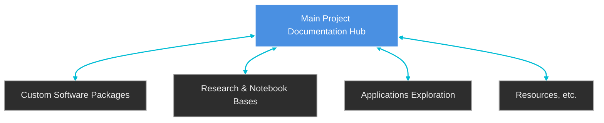

# Project Overview

At its core, this project explores sequential substitution systems (SSS, or “sessies”)—simple rule-based processes that generate surprisingly rich and complex behavior. A sessie begins with nothing more than a string of symbols and a set of replacement rules. Yet from these minimal ingredients, entire “toy universes” unfold: strings evolve step by step, events create and destroy symbols, and causal networks emerge that capture the deep structure of how one event leads to another. This makes sessies a powerful laboratory for studying how complexity arises from simplicity, a theme that resonates across mathematics, physics, and computer science.

This site serves as the central documentation hub for our research group. Its purpose is twofold: first, to help new contributors get started quickly with the tools, workflows, and policies that shape our work; and second, to provide a living record of the progress, discussions, and discoveries that emerge across our projects. By consolidating onboarding guides, software usage notes, and research updates in one place (whether directly on the pages or as links), we aim to make our collective work more transparent, reproducible, and accessible to both current and future collaborators.

A key part of this effort is the **[Introductory Notebooks Repository](https://sessieresearchatsau.github.io/introductory-notebooks/)** (formerly called the FAQ). This evolving collection of notes captures both foundational concepts—such as sequential substitution systems (or “sessies”), causal networks, and enumeration methods. The notebooks includes introductions to Sessie rulesets and their causal structures, discussions of dimensionality in substitution systems, and methods for indexing and enumerating rulesets. These notebooks are not just background reading; they are working guides that can be adapted, extended, and tested as our research develops.

If you are new to the project, we recommend beginning with the setup and software usage guides. These will walk you through installing the necessary tools, running example notebooks, and understanding the conventions we follow for documenting results. Once you are comfortable with the basics, the Introductory Notebooks will help you explore deeper theoretical questions and connect them to the computational experiments we run. As you contribute, please also take note of our workflow and policy pages, which ensure consistency and clarity across repositories.

Ultimately, this site is meant to be more than a static manual. It is a shared documentation hub/workspace where we record the broad happenings of our research—what we tried, what worked, what didn’t, and what we learned along the way. By treating documentation as a first-class part of the research process, we create a durable record that supports collaboration, invites new perspectives, and strengthens the long-term impact of our work.

## Organizational Structure
The Sessie Research Group is organized around a central documentation hub, which serves as the entry point for all repositories. Each repository is linked back to this hub and maintains its own documentation, ensuring that contributors can both work independently and stay connected to the larger effort. Repositories may take different forms: some are **software packages** that implement algorithms and frameworks, others are **research or notebook bases** that capture theoretical explorations and experiments (these often use the code developed in the software packages), and still others are **applications-focused projects** that extend substitution system ideas into domains like music, biology, or visualization. This modular structure allows the project to grow in multiple directions while maintaining coherence through shared policies, references, and documentation standards.

This diagram shows the **hub-and-spoke model**: the central documentation site anchors the project, while each repository contributes specialized content. Whether a repo is a codebase, a collection of notebooks, or an applied exploration, it is always documented and linked back to the hub.

> Documentation forms the foundation of all research. Without it, inquiry remains confined to the fleeting thoughts of the researcher, inaccessible to others and irreproducible over time. The act of articulating that which is fundamentally true—whether abstract or concrete—in words or formulas is what transforms exploration into knowledge. It is through documentation that research becomes durable, communicable, and ultimately meaningful.

## Tips for Getting Started

1. **Set up your environment**  
   Follow the [Software Quickstart](software/mathematica.md) guides for Mathematica, Python/Conda, Git/GitHub, and/or Markdown to ensure your tools are installed and configured. Note that setting up all this software may not be necessary depending on your research role.

2. **Review team policies**  
   Read through the [Team Policy & Management](policy/contribution-policy.md) section to understand our workflow, contribution standards, and collaboration practices.

3. **Explore the Notebook Reference**  
   Begin with the [Introductory Notebooks](https://sessieresearchatsau.github.io/introductory-notebooks/) for introductions to Sessie rulesets, causal networks, and enumeration methods. These notebooks provide both conceptual grounding and practical examples.

4. **Check out active repositories**  
   Visit the [Research Repositories](research/repos.md) page to see current projects, codebases, and documentation.

5. **Start small, document often**  
   Run example notebooks, make small contributions, and record your progress. Clear documentation is as important as the research itself.
